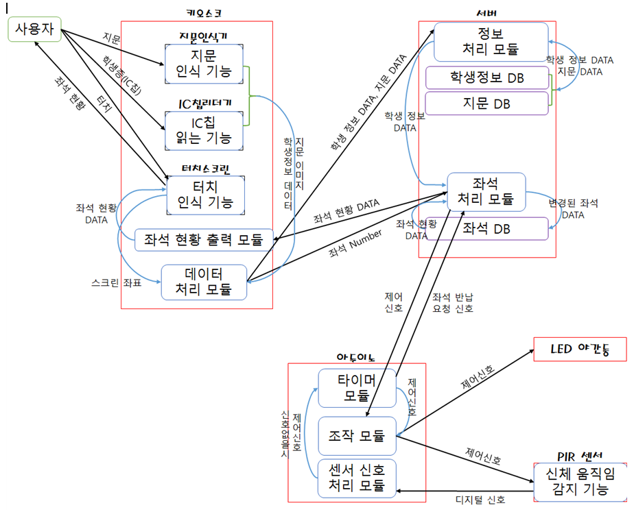

#**7조 최종 설계 보고서**

**컴퓨터 시스템 기초 설계**

**3분반**

**강승우 교수님**

**2014136127 최선문**

**2015136079 오태영**

**2015136024 김성현**

**제출 일자 2016/06/08**

##**목            차**
###**1. 문제와 필요성**

- 문제 상황
- 문제 정의
- 진짜 문제 정의
- 필요성

###**2. 요구사항 및 아이디어**

- 시스템 요구사항
- 해결책에 대한 아이디어
- 유사한 문제를 해결한 기존의 방법/아이디어
- 기존의 방법/아이디어 대비 본인들의 차별성 및 장점

###**3. 전체 시스템 구조 설계**

- 시스템 구조
- 시스템의 기능
- 시스템의 구성요소 및 각 구성 요소의 기능, 입출력 데이터
- 각 시스템 기능 별 시스템 구성 요소 간의 동작 흐름
- 핵심 구성 요소 상세 설계

###**4. 구현에 필요한 기술 및 개발 환경에 대한 조사**

- 기술
- 개발환경

###**5. 과제 수행 내용에 대한 각자 의견 및 소감**

####**1. 문제와 필요성**

- 문제상황
>  한국기술교육대학교에 입학 한 신입생(20)씨. 이제 막 성인이 된 그는 주체할 수 없는 자유에 술도       자주 마시러 다니고 여러 군데를 돌아다니며 놀기 좋아하는 학생이었다. 어느덧 정신을 차려보니,       시험은 코앞으로 다가왔고, 부모님의 야단이 두려웠던 신 씨는 마음을 굳게 먹고 다산정보관 열람실을    이용하려 했다. 하지만, 열람실 좌석을 신청하려고 기계 앞에 서니, 이미 좌석은 만석. 포기하고         돌아서는 순간 그의 눈엔 열람실의 텅텅 빈 모습이 들어왔다. 신 씨는 분노했으나, 시스템 상으로는     아무런 문제가 없으므로 어디 가서 호소할 곳도 없었다.

- 문제정의(5Whys)

| **순서**    | **질 문** | **답** |
| ---------- | ---------- | -------- |
|1  |왜 열람실을 이용하지 못하는가? | 열람실이 시험기간 때 비효율적으로 운영이 되고 있기 때문이다. |
|2  |왜 열람실이 비효율적으로 운영이 되고 있는가? | 사람은 없지만 좌석은 대급되어 있기 때문이다.|
|3  | 왜 사람이 없음에도 좌석이 대급되어 있는가? | 시스템 상에서 자동으로 반납처리가 되지 않기 때문이다. |
|4  | 왜 자동으로 반납처리가 되지 않는가? | 시스템적으로 사람이 있는지 없는지를 구분하지 못하기 때문이다.|
|5  | 왜 사람이 있는지 없는지 구분을 못하는가? | 사람의 유무를 확인하는 장치가 없기 때문이다. |

- 진짜 문제 정의

> 사람의 유무를 확인할 수 있는 어떤 센서, 장치 등이 없어 좌석이 비어도 시스템적으로 처리가 안 돼 시험기간 때 비효율적으로 운영되고 있는 열람실의 개선이 필요하다.

- 필요성

> 학교 다산 정보관을 상대로 한 공식적 통계가 없기에 설문지를 따로 제작해 학생들의 현재 좌석 시스템 만족도와 학생들이 얼만큼의 불편함을 느끼는지 조사해보았다. 조사 결과 상당수의 학생들이 불만족한 것으로 조사되었고, 그 중 대부분의 학생들이 상당한 불편함을 느끼고 있다고 대답해주었다.

####**2. 요구사항 및 아이디어**

- 시스템 요구사항

> 1. 사람의 유무를 확인할 수 있어야한다.
> 2. 장치나 센서의 소음이 없어야한다.
> 3. 어느 시점부터 공석으로 볼 건지 기준이 필요하다.
> 4. 한 사람이 여러 사람의 자리를 예약할 수 없도록 해야한다.

- 해결책에 대한 아이디어

> 한 사람이 여러 사람의 자리를 예약할 수 없도록 자리를 예약할 때 지문 인식 방식을 도입한다. 유무를 확인 할 수 있는 센서는 아두이노와 PIR센서를 이용한다. PIR센서를 이용한 것은 센서에 소음이 없어야하는데, 빛을 이용하는게 가장 적법하다고 판단했기 때문이다. 추가로 책상 각 자리의 구석에 자리의 공석 유무를 알 수 있는 등을 설치한다. 이때의 등은 LED 야간등을 이용한다. 이 야간등은 자리가 공석일 때만 켜지며 자리가 예약되어 있거나 유예시간 일시에는 꺼진다. 등을 야간등으로 설치하는 이유는 이용하는 학생들의 공부에 방해가 되지 않는 조도를 위함이다. 색깔은 눈의 피로를 덜기 위해 녹색 계열로 하는 것을 권장한다. 배선은 책상 정중앙 아랫면을 뚫어 전원을 공급한다. 기계와의 송수신은 유선으로 한다. 공석의 기준은 이용자가 자리를 20분동안 비우게 되면, 즉, 20분 동안 신호가 없을 시 공석으로 전환한다.

- 유사한 문제를 해결한 기존의 방법/아이디어

1. 많은 공립 도서관이나 대학에서 사용되고 있는 무인 좌석 시스템
> 현재 Koreatech 도서관 열람실에서도 사용되고 있으며 학생증이나 지문 인식을 통해서 개인당 하나의 자리를 배치해 주는 시스템. 약 2시간 동안 사용시간을 주고 그 이후에 다시 인식을 통해 사용시간을 갱신한다. 이 시스템이 사용되고 있는 Koreatech 도서관에서 발생하는 문제를 보면 좌석을 예약하고 사용하지 않는 경우나, 예약 없이 사용하는 행위, 갱신을 안 해서 시스템 상 빈 자리로 인식되는 경우 같은 문제들이 발생하고 있다.

2. 모바일 기기를 사용해 자리 조회 및 예약하는 시스템
> 각 도서관 관련된 어플을 사용해서 좌석 현황을 확인하고 예약하는 시스템. Koreatech에서도 좌석      현황 확인 기능 어플을 제공하고 있다. 사용자에게 더 편리한 환경을 제공하지만 열람실 좌석 사석화      문제를 해결하는 근본적인 해결책은 될 수 없다.

- 기존 방법/아이디어 대비 본인들의 차별성 및 장점

1. 지문 인식 방법을 통해서 1인당 한 자리만을 직접 예약할 수 있도록 만들어서 한 사람이 여러 자리를 예약하는 것을 방지한다.
2. 자리 실제 사용 유무를 PIR 센서를 통해 확실하게 판별할 수 있도록 하여 열람실이 효율적으로 사용 되게 한다.
3. 자리를 비운 시간에 따라 책상위의 등을 켜서 비양심 사용자의 짐을 치울 수 있도록 유도한다. 참고로 2009년 4월 20일 서울행정법원 행정 2부에서 밝힌 내용 중에 서울시립대에서 도서관 열람실 사석화 한 학생들을 대상으로 도서관 대출 금지 제재를 했으나 학생들이 학교를 대상으로 소송을 냈다. 그러나 도서관의 열람실 자리를 개인적으로 독점하는 행위를 제재하는 학교 측의 조치가 정당하다는 판결이 나왔다.

##**3. 전체 시스템 구조 설계**
###**3-1. 시스템 구조**

그림 2 시스템 구조

###**3-2. 시스템의 기능**
1. 신규 사용자 등록기능
2. 좌석 대여 기능
3. 좌석 반납 기능
4. 좌석 대여 중, 해당 좌석의 사람 존재 유무 확인 기능
5. 좌석 대여 중, 사람이 없을 때 좌석 반납을 20분동안 유예시키는 기능
6. 유예 시간이 끝난 후, 자동으로 좌석 반납 처리 기능

###**3-3. 시스템의 구성요소 및 각 구성 요소의 기능, 입출력 데이터**

####**1) 키오스크 : 사용자로부터 다양한 정보를 입력받고 스크린을 통해 좌석 정보를 출력해주는 장치**

> - 지문인식기
>	    사용자로부터 지문을 받아 이미지화 시킨다.

>	   Input : 지문

>	   Output : 지문 이미지

> - IC칩 리더기

>	    사용자로부터 IC칩을 받아 IC칩에 저장된 학생정보 데이터를 읽는다.

>	   Input : IC칩

>	   Output : IC칩에 있는 학생정보 데이터

> - 터치스크린

>	    사용자의 터치를 인식 한다.

>	    좌석 데이터를 받아 좌석 현황을 출력한다.

>	   Input : 사용자의 터치, 좌석 현황 데이터

>	   Output : 입력 판별 된 스크린 좌표, 좌석 현황

> - 데이터 처리 모듈

>	    지문인식기와 IC칩 리더기로부터 데이터를 받아 적절히 변환한 후 서버에 전송한다.

>	    터치스크린으로부터 좌표를 받아 서버로 전송한다.

>	   Input : 지문 이미지, 학생정보 데이터, 스크린 좌표

>	   Output : 학생정보 데이터, 지문 데이터, 좌석 넘버

> - 좌석 현황 출력 모듈

>	    서버로부터 좌석 현황 데이터를 받아 터치스크린으로 넘겨준다.

>	   Input : 좌석 현황 데이터

>	   Output : 좌석 현황 데이터

####**2) 서버 : 키오스크에서 전송된 정보를 저장하고, 아두이노를 제어하는 장치**

> - 정보 처리 모듈

>	    키오스크에서 전송된 각 정보들을 각각의 DB로 전송한다.

>	    학생정보 데이터와 지문 데이터를 한데 엮어준다.

>	    기존 사용자의 지문을 키오스크에서 받아 해당 학생 정보를 찾아낸다.

>	    좌석 처리 모듈로 학생 정보 데이터를 보낸다.

>	   Input : 지문 데이터, 학생 정보 데이터, 저장된 학생 정보 데이터, 저장된 지문 데이터

>	   Output : 처리된 지문 데이터, 처리된 학생 데이터

> - 좌석 처리 모듈

>	   키오스크로부터 좌석 넘버와, 정보 처리 모듈로부터 학생정보 데이터를 받아 좌석 DB를 업데이트 한다.

>	    좌석 DB로부터 좌석 현황 데이터를 받아 키오스크로 넘겨준다.

>	    좌석 대여시 해당 좌석 아두이노를 작동하는 신호를 보낸다.

>	    아두이노로부터 좌석 반납 요청을 받으면 좌석 DB를 업데이트 시켜 반납 처리한다.

>	   Input : 학생정보 데이터, 좌석 넘버, 좌석 현황 데이터, 좌석 반납 요청 신호

>	   Output : 좌석 현황 데이터, 변경된 좌석 데이터, 아두이노 제어신호

> - 지문DB

>	    처리된 지문 정보를 저장한다.

>	   Input : 입력된 지문 데이터

>	   Output : 저장된 지문 데이터

> - 학생정보 DB

>	    처리된 학생정보 정보를 저장한다.

>	   Input : 입력된 학생정보 데이터

>	   Output : 저장된 학생정보 데이터

> - 좌석 DB

>	    변경된 좌석 데이터를 받아서 좌석 대여 유무를 저장한다.

>	   Input : 변경된 좌석 데이터

>	   Output : 좌석 현황 데이터 

####**3) 아두이노 : 열람실 각 좌석에 부착되어서 사람의 유무를 확인하고 좌석 자동 반납 유예 및 처리 기능을 한다.**

>  - 조작 모듈

>	    서버로부터 신호를 받아서 아두이노의 각 기능들이 작동하도록 신호를 보낸다.

>	    타이머모듈로부터 정지 신호를 받으면 각 기능들이 정지하도록 신호를 보낸다.

>	   Input : 제어신호

>	   Output : LED 동작 신호, PIR센서 동작 신호

>  - 센서 신호 처리 모듈

>	    PIR 센서로부터 디지털 신호를 받아 사람 유무를 판별한다.

>	    신호가 없을 시에는 타이머모듈로 제어 신호를 보낸다.

>	   Input : 디지털 신호

>	   Output : 타이머 모듈 제어 신호
	
	
>  - 타이머 모듈

>	    센서 신호 처리 모듈로부터 제어 신호가 들어오면 유예시간 타이머를 작동한다.

>	    유예 시간이 지난 후 서버로 좌석 반납 요청 신호를 보내고, 조작 모듈로 제어 신호를 보낸다.

>	   Input : 타이머 모듈 제어 신호

>	   Output : 좌석 반납 요청 신호, 조작 모듈 제어 신호

>  - LED 야간등

>	    제어신호가 들어오면 점등 및 소등한다.

>	   Input : 제어 신호

>	   Output : 빛

 
>  - PIR 센서

>	    제어신호가 들어오면 감지 기능을 작동하고, 디지털 신호를 아두이노로 보낸다.

>	   Input : 제어 신호

>	   Output : 디지털 신호

